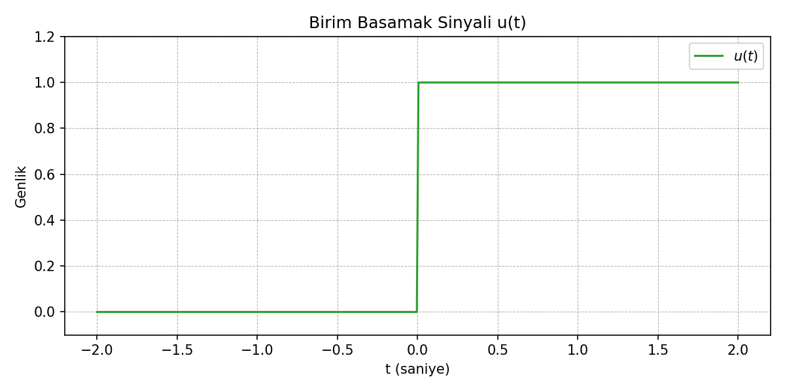

### Birim Basamak Fonksiyonu Örneği

Bu klasörde yer alan `birim_basamak_ornegi.py`, NumPy kullanarak birim basamak sinyalini oluşturur ve Matplotlib ile görselleştirir.

```python
import numpy as np
import matplotlib.pyplot as plt


def unit_step(t: np.ndarray) -> np.ndarray:
    return np.where(t >= 0.0, 1.0, 0.0)


def plot_unit_step():
    t = np.linspace(-2, 2, 400)
    signal = unit_step(t)

    plt.figure(figsize=(8, 4))
    plt.plot(t, signal, color="tab:green", label=r"$u(t)$")
    plt.title("Birim Basamak Sinyali u(t)")
    plt.xlabel("t (saniye)")
    plt.ylabel("Genlik")
    plt.grid(True, linestyle="--", linewidth=0.5)
    plt.ylim(-0.1, 1.2)
    plt.legend()
    plt.tight_layout()
    plt.savefig("birim_basamak_ornegi.png", dpi=150)
    plt.show()


if __name__ == "__main__":
    plot_unit_step()
```

### Oluşturulan Grafik



