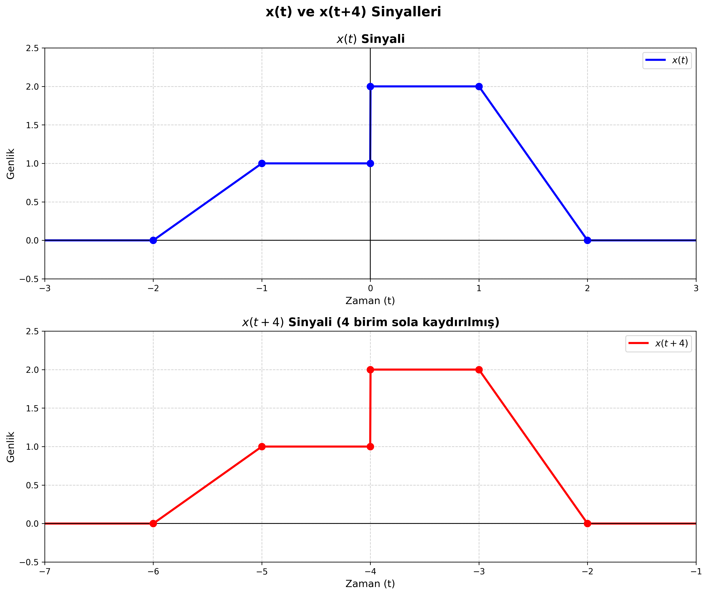

### Zaman Kaydırması (Time Shift) Örneği

Bu klasörde yer alan `zaman_kaydirmasi.py`, parça parça lineer bir x(t) sinyalini tanımlar ve bu sinyalin zaman kaydırması (time shift) işlemini gösterir. x(t+4) sinyali, x(t) sinyalinin 4 birim sola kaydırılmış halidir.

#### Sinyal Tanımı

x(t) sinyali aşağıdaki parça parça lineer fonksiyonla tanımlanmıştır:

- **t < -2**: 0
- **-2 ≤ t < -1**: 0'dan 1'e lineer artış (eğim = 1)
- **-1 ≤ t < 0**: 1 seviyesinde sabit
- **t = 0**: 1'den 2'ye sıçrama
- **0 ≤ t < 1**: 2 seviyesinde sabit
- **1 ≤ t ≤ 2**: 2'den 0'a lineer azalış (eğim = -2)
- **t > 2**: 0

#### Zaman Kaydırması İşlemi

Zaman kaydırması, bir sinyalin zaman ekseninde ötelenmesi işlemidir:

- **x(t + τ)**: Sinyal **τ birim sola** kaydırılır (ileri kaydırma)
- **x(t - τ)**: Sinyal **τ birim sağa** kaydırılır (gecikme)

Bu örnekte x(t+4) sinyali, x(t) sinyalinin 4 birim sola kaydırılmış halidir. Bu nedenle:
- x(t)'nin t = -2'de başlayan özellikleri, x(t+4)'te t = -6'da başlar
- x(t)'nin t = 0'daki sıçraması, x(t+4)'te t = -4'te gerçekleşir
- x(t)'nin t = 2'de biten özellikleri, x(t+4)'te t = -2'de biter

#### Kod Yapısı

```python
def x_t(t: np.ndarray) -> np.ndarray:
    """
    Parça parça lineer x(t) sinyalini hesaplar.
    """
    x = np.zeros_like(t)
    
    # Her segment için mask kullanarak sinyal değerlerini hesapla
    mask1 = (-2 <= t) & (t < -1)
    x[mask1] = t[mask1] + 2  # Lineer artış
    
    mask2 = (-1 <= t) & (t < 0)
    x[mask2] = 1.0  # Sabit seviye
    
    # ... diğer segmentler
    
    return x

def plot_x_t_and_x_t_plus_4():
    """
    x(t) ve x(t+4) sinyallerini ayrı subplot'larda çizer.
    """
    # x(t) sinyalini hesapla
    x_original = x_t(t_original)
    
    # x(t+4) sinyalini hesapla (4 birim sola kaydırma)
    x_shifted = x_t(t_shifted + 4)
    
    # İki ayrı subplot oluştur ve grafikleri çiz
    # ...
```

#### Oluşturulan Grafik



Grafik iki ayrı çerçevede gösterilir:
- **Üst çerçeve**: Orijinal x(t) sinyali (mavi çizgi)
- **Alt çerçeve**: x(t+4) sinyali - 4 birim sola kaydırılmış (kırmızı çizgi)

#### Çalıştırma

```bash
python zaman_kaydirmasi.py
```

Program çalıştırıldığında:
1. Grafik ekranda gösterilir
2. Grafik `zaman_kaydirmasi.png` olarak aynı klasöre kaydedilir (300 DPI çözünürlükte)

#### Kullanım Alanları

| Alan | Nerede Karşımıza Çıkar? | Not |
| --- | --- | --- |
| **İşaret ve Sistemler** | Sinyal işleme, filtreleme, konvolüsyon işlemleri | Zaman kaydırması, sistem analizinde temel bir dönüşümdür. |
| **Haberleşme Sistemleri** | Sinyal senkronizasyonu, gecikme analizi | Veri paketlerinin zamanlama analizinde kritik öneme sahiptir. |
| **Kontrol Teorisi** | Sistem gecikmeleri, zaman gecikmeli sistemler | Kontrol sistemlerinde gecikme analizi için kullanılır. |
| **Ses İşleme** | Echo, reverb efektleri, zaman gecikmeleri | Ses sinyallerinin zaman kaydırması ile yankı efektleri oluşturulur. |
| **Radar ve Sonar** | Hedef tespiti, mesafe ölçümü | Sinyal gönderim ve alım zamanları arasındaki fark mesafe hesaplamasında kullanılır. |
| **Dijital İşaret İşleme** | Filtre tasarımı, konvolüsyon, korelasyon | Zaman kaydırması, dijital filtrelerin temel işlemlerinden biridir. |

#### Matematiksel Notlar

- **Zaman Kaydırması Özelliği**: x(t + τ) sinyali, x(t)'nin tüm özelliklerini τ birim sola taşır
- **Süreklilik**: Kaydırma işlemi sinyalin şeklini değiştirmez, sadece zaman ekseninde konumunu değiştirir
- **Periyodik Sinyaller**: Periyodik sinyallerde zaman kaydırması, faz kayması olarak da ifade edilir

#### Gereksinimler

- Python 3.x
- NumPy
- Matplotlib

